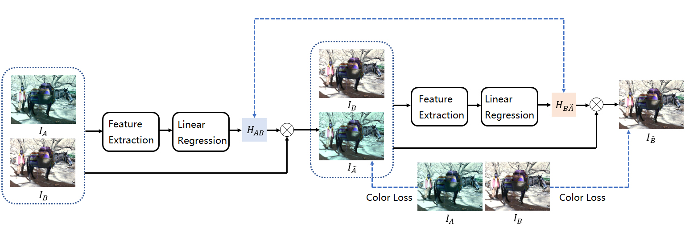
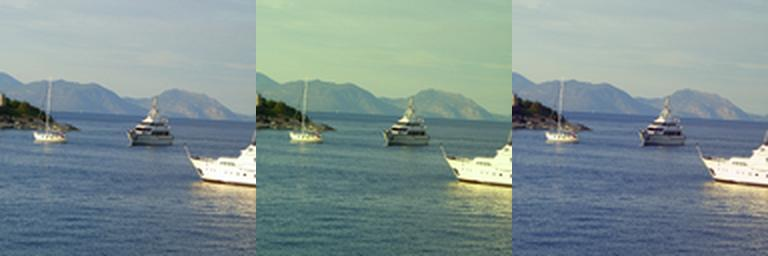

# DeepColor
This is the PaddlePaddle implementation of unsupervised deep color correction approach.
> We are preparing our manuscript

## Dataset

VOC2012 dataset can be downloaded from [here](http://host.robots.ox.ac.uk/pascal/VOC/voc2012/VOCtrainval_11-May-2012.tar). 

You can also use your own dataset, modify `data_root` in train.py to your own dataset.

## Requirements

- Python 3+
- PaddlePaddle-gpu 2.4+
- Paddle_msssim
- OpenCV

You can install the missed dependencies according to the compilation errors.

## Train and test

After downloading dataset and our code, you need to  modify `data_root` in train.py.   
checkpoint_epoch_99.pth is our trained model.

## Results
We have provided some examples of color correction in ./results.  

For example, the left image is the original image, the middle image is the image with color difference, and the right image is the image after color correction from the middle image by DeepColor.

## Contact:
Li Li (li.li@whu.edu.cn)

